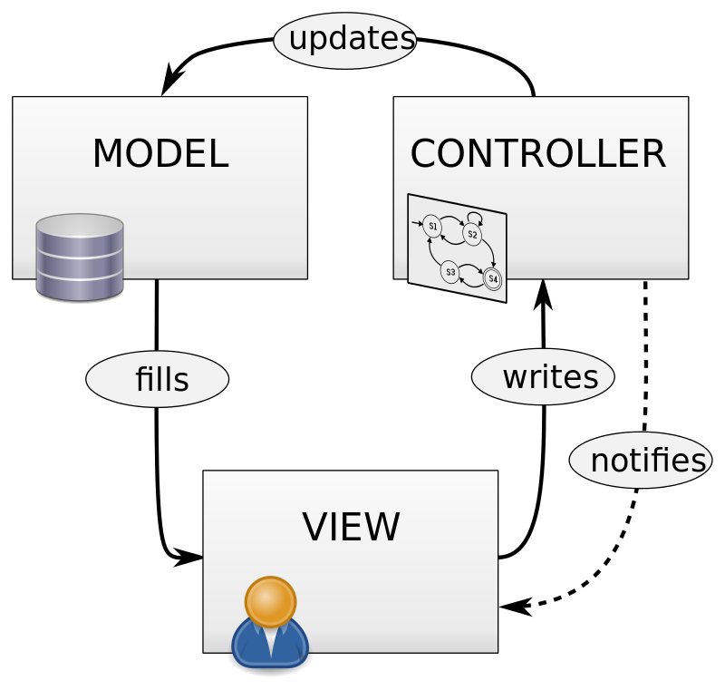

= GreenFoot: Etapa 4

V dnešní cvičení napojíme herní logigu s grafickým designem pomocí herního enginu https://www.greenfoot.org[GreenFoot].

== Koncept herního modelu

V rámci vývoje naší hry budeme používat koncept odvozený od návrhového vzoru MVC:

V našem pojetí, bude ale tento model trochu upravený:

. *Model*: Jsou třídy s naší herní logikou.
 Model uchovává veškerý data a stav hry, rovněž poskytuje metody, které tento stav mění.

. *View*: Jsou třídy, které jsou potomci `World` a `Actor` z projektu Greenfoot.
 Starají je o _prezentaci_ třídy z modelu a informací v nich obsažených v GUI.
 Samy o sobě uchovávají pouze data, která potřebují k tomuto úkplu a která jím neposkyuje model.

Mezi třídy modulu a view exituje vztah _m:n_, tedy záleží plně na požadavcích herního design.

. *Controller*: Greenfoot nemá kontrolery jak jsme na ně zvykí z klasických GUI frameworků.
 Místo toho `Actors` mají metodu `act()`. V této metodě musí actor sám detekovat událost, která aktivuje jeho akci (například aktualizace vzhledu nebo posun na desce).

Metoda `act()` se volá v herní smyčce, tedy cca 30 krát za vteřinu a může proto řídit i animace.

=== Třída `World`

Tato třída přdstavuje pozadí hry a uchovává rovněž vešchny actory.

=== Třída `Actor`

Reprezentuje herní prvek, který mění obsah nebo interaguje s uživatlem.

=== Třída `Greenfoot`

Pomocí teto třídy zjišťujeme události způsobené uživatlem (klik myši) a ovládáme celou hru.

== Rozšíření hry Hangman o GUI.

V následjími praktické fázi cvičení si napojíme dříve implementovanou hru *Hangman* na GUI pomocí Greenfoot.

=== 1. Konfigurace

Nejprve musíme do hry zapojit knihovnu Greenfoot

Abychom nemuseli knihovnu ukládat spolu s projektem, můžeme ji stáhnu z úču xkoloma 1 na akele, nebo použít oficiální zdroj z https://github.com/benoitheinrich/greenfoot-runner-example/blob/master/libs/greenfoot-runner-dist-3.0.4-SNAPSHOT.jar[Github]

===== build.gradle

[source,groovy]
----
def urlFile = { String url  ->
    File file = new File("$buildDir/libs/${url.substring(url.lastIndexOf("/"))}")
    file.parentFile.mkdirs()
    if (!file.exists()) {
        new URL(url).withInputStream { downloadStream ->
            file.withOutputStream { fileOut ->
                fileOut << downloadStream
            }
        }
    }
    files(file.absolutePath)
}

dependencies {
    compile urlFile('https://akela.mendelu.cz/~xkoloma1/pjj/libs/greenfoot-runner-dist-LAST.jar')

    compile 'org.apache.commons:commons-lang3:3.11'
    testCompile "org.junit.jupiter:junit-jupiter:5.+"
}
----